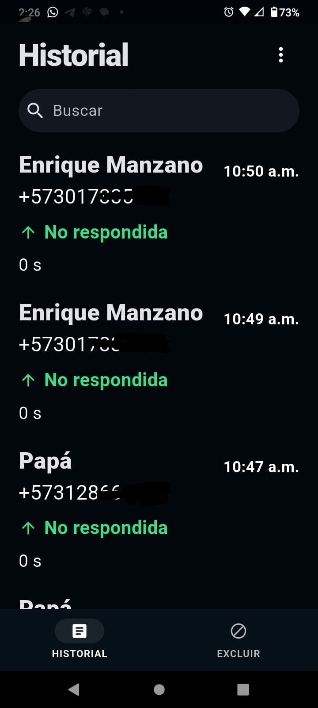
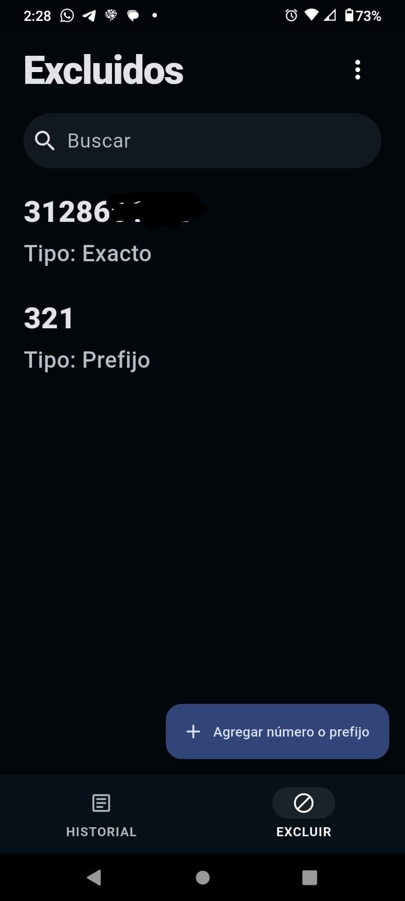
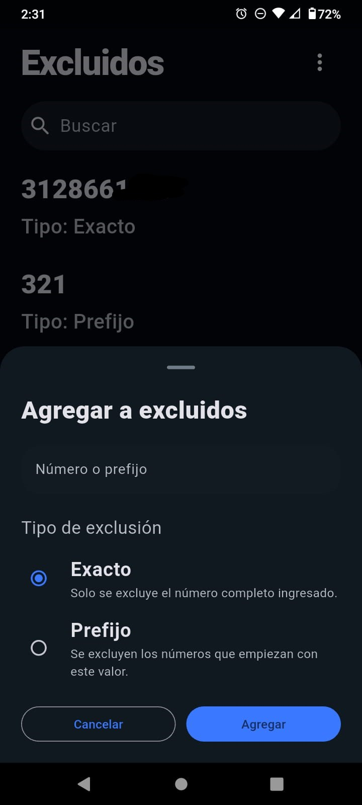

# CallLog Guard

CallLog Guard es una aplicación Android desarrollada en Flutter para registrar, consultar y administrar llamadas salientes de forma local. La app permite sincronizar llamadas salientes desde el registro del teléfono, guardarlas en SQLite, visualizar el historial almacenado, buscar llamadas, eliminar registros locales y administrar una lista de números o prefijos excluidos por privacidad. Toda la información se almacena únicamente en el dispositivo y no se envía a servidores externos.

## Permisos usados

La aplicación utiliza los siguientes permisos de Android:

```xml
<uses-permission android:name="android.permission.READ_CALL_LOG" />
<uses-permission android:name="android.permission.READ_CONTACTS" />
```
<p align="center">
  
  
  
</p>

